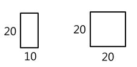
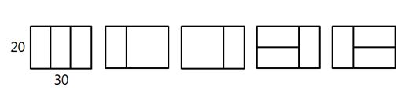

# 11. 종이 붙이기

 **※ SW Expert 아카데미의 문제를 무단 복제하는 것을 금지합니다.**  
  
  
어린이 알고리즘 교실의 선생님은 경우의 수 놀이를 위해, 그림처럼 가로x세로 길이가 10x20, 20x20인 직사각형 종이를 잔뜩 준비했다.  




그리고 교실 바닥에 20xN 크기의 직사각형을 테이프로 표시하고, 이 안에 준비한 종이를 빈틈없이 붙이는 방법을 찾아보려고 한다. N이 30인 경우 다음 그림처럼 종이를 붙일 수 있다.



 10의 배수인 N이 주어졌을 때, 종이를 붙이는 모든 경우를 찾으려면 테이프로 만든 표시한 영역을 몇 개나 만들어야 되는지 계산하는 프로그램을 만드시오. 직사각형 종이가 모자라는 경우는 없다.  
  
  
**\[입력\]**  


```python
첫 줄에 테스트 케이스 개수 T가 주어진다. 1≤T≤50
다음 줄부터 테스트 케이스 별로 N이 주어진다. 10≤N≤300, N은 10의 배수
--------------------------------------------------------------
3
30
50
70
--------------------------------------------------------------
```

  
  
**\[출력\]**

```python
각 줄마다 "#T" (T는 테스트 케이스 번호)를 출력한 뒤, 답을 출력한다.
--------------------------------------------------------------
#1 5
#2 21
#3 85
--------------------------------------------------------------

```



```python
def addBlock(x):	
    if x>N: return 0	
    elif x == N : return 1	
    else: return addBlock(x+10) + addBlock(x+20)*2

t = int(input())
for test_case in range(1, t+1):	
    N = int(input())	
    num = addBlock(0)	
    print("#{} {}".format(test_case, num))
```

이 문제의 다른사람 풀이를 보았을 때 솔직하게 좌절을 했다.

이렇게 간단하게 풀어 낼 수 있는 문제인데 난 왜 며칠동안 이 생각을 못했을까 라고 말이다. 그치만 이제는 dfs를 이런식으로 구현하는 것을 알게 되었고 나 역시 사용 할 수 있다는 것에 감사함을 느낄뿐이다.

문제풀이는 간단하다. 

생길 수 있는 타일의 경우를 트리 형태로 나타내서 중복되는 걸 없애면 어떤 식으로 dfs를 구성 해야할지 감이 잡힐것이다.

ㅁ무문



```python
def addBlock(x):	
    if x>N: return 0	
    elif x == N : return 1	
    else: return addBlock(x+10) + addBlock(x+20)*2

t = int(input())
for test_case in range(1, t+1):	
    N = int(input())	
    num = addBlock(0)	
    print("#{} {}".format(test_case, num)) 
```

사실 이 문제는 생각이 한번에 안나서 다른 사람의 코드를 보고 충격을 먹은 문제다. 이렇게 간단한 것이었는데 생각을 못했다는 것에 사실 조금 나 자신에 실망감을 느꼈었다. 




