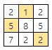

# 18. 배열 최소 합

**※ SW Expert 아카데미의 문제를 무단 복제하는 것을 금지합니다.**

### **\[ 문제 \]**

NxN 배열에 숫자가 들어있다. 한 줄에서 하나씩 N개의 숫자를 골라 합이 최소가 되도록 하려고 한다. 단, 세로로 같은 줄에서 두 개 이상의 숫자를 고를 수 없다.  
  
조건에 맞게 숫자를 골랐을 때의 최소 합을 출력하는 프로그램을 만드시오.  
 

예를 들어 다음과 같이 배열이 주어진다. 



이경우 1, 5, 2를 고르면 합이 8로 최소가 된다.


### **\[ 입력 \]**

```python
첫 줄에 테스트 케이스 개수 T가 주어진다.  1≤T≤50

다음 줄부터 
테스트 케이스의 첫 줄에 숫자 N이 주어지고, 

이후 N개씩 N줄에 걸쳐 10보다 작은 자연수가 주어진다. 3≤N≤10

------------------------------------------------------
3
3
2 1 2
5 8 5
7 2 2
3
9 4 7
8 6 5
5 3 7
5
5 2 1 1 9
3 3 8 3 1
9 2 8 8 6
1 5 7 8 3
5 5 4 6 8
------------------------------------------------------

```

\*\*\*\*

### **\[ 출력 \]**

```python
각 줄마다 "#T" (T는 테스트 케이스 번호)를 출력한 뒤, 
합계를 출력한다.

------------------------------------------------------
#1 8
#2 14
#3 9
------------------------------------------------------
```

### 

### \[ 코드 \]



```python
def findAns(row, col, visited, able, total, N):
    total += mtrx[row][col]
    pre_visited=visited[:]
    pre_able = able[:]
    pre_total = total
    
    if min(sumList)<total: return 
    
    if len(pre_visited)==N:
        sumList.append(total)
        return total
    else:
        for c in pre_able:
            visited.append(c)
            able.remove(c)
            total = findAns(row+1, c, visited, able, total, N)
            able = pre_able[:]
            visited = pre_visited[:]
            total = pre_total

def search(mtrx, N):
    for col in range(N):  
        visited, able = [col], []
        total = 0
        for c in range(N):
            if c not in visited : able.append(c)        
        findAns(0, col, visited, able, total, N)
        
    return min(sumList)
    

t = int(input())
for test_case in range(1, t+1):
	N = int(input())
	mtrx = [list(map(int, input().split())) for _ in range(N)]
	sumList = [999999999]
	answer = search(mtrx, N)
	print(f'#{test_case} {answer}')
```

 처음 문제를 푼 방법은 dfs써서 합을 모두 구해서 그 중 가장 작은값을 반환하도록 했다. 그러나 dfs가 익숙하지 않아서 구현하는데 삼일이 걸렸다. 되도록이면 global 함수를 쓰지 않기 위해서 미리 선언 해줘야 할 것들과 다음 재귀호출 전에 보관해야 할 값들을 생각하는데 많은 시간이 필요했기 때문이다. 

  test\_case는 올바르게 동작했지만 제출 시에는 제한시간 초과가 걸렸다. 결국 dfs로 모든 경우의 수를 다 만든 것이 원인이었다. 따라서 back tracking이 필요하다는 것을 알았다.

 다른 사람의 코드를 보고 얻은 힌트로 한줄의 조건을 추가함으로써 pass했다. 

 if min\(sumList\) &lt; total : return  
  
값을 더해 나갈때, 이미 끝까지 더한 값들 중 가장 작은 값보다 크면 더할 필요없이 탈출하는 back tracking 조건을 추가함으로써 모든 조건을 다 살펴 볼 필요가 없어지게 된다. 



```python
def MyCalc(y):
    global sub_result, result

    if result < sub_result:
        return

    if y == N:
        if sub_result < result:
            result = sub_result
        return

    for x in range(N):
        if not visited[x]:
            visited[x] = True
            sub_result += lst[y][x]
            MyCalc(y+1)
            visited[x] = False
            sub_result -= lst[y][x]


TC = int(input())
for tc in range(1, TC+1):
    N = int(input())
    lst = [list(map(int, input().split())) for _ in range(N)]
    visited = [0] * N
    sub_result, result = 0, 987654321
    MyCalc(0)

    print(f'#{tc} {result}')
    
#출처 : https://tothefullest08.github.io/algorithm/2019/03/08/2_4881_min_sum/
```

내가 참조한 코드이다. 이 사람의 코드를 보면서 항상 어떻게 이렇게 깔끔하고 간단하게게 구현할 수 있는지 감탄 하면서 배워나간다.



