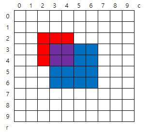

# 4. 색칠하기

**※ SW Expert 아카데미의 문제를 무단 복제하는 것을 금지합니다.**  


### \[ 문제 \]

그림과 같이 인덱스가 있는 10x10 격자에 빨간색과 파란색을 칠하려고 한다.  
  
N개의 영역에 대해 왼쪽 위와 오른쪽 아래 모서리 인덱스, 칠할 색상이 주어질 때, 칠이 끝난 후 색이 겹쳐 보라색이 된 칸 수를 구하는 프로그램을 만드시오.  
  
주어진 정보에서 같은 색인 영역은 겹치지 않는다.  
 



  
예를 들어 2개의 색칠 영역을 갖는 위 그림에 대한 색칠 정보이다.

2

2 2 4 4 1  \( \[2,2\] 부터 \[4,4\] 까지 color 1 \(빨강\) 으로 칠한다 \)

3 3 6 6 2 \( \[3,3\] 부터 \[6,6\] 까지 color 2 \(파랑\) 으로 칠한다 \)  
  
 

### **\[ 입력 \]**

첫 줄에 테스트 케이스 개수 T가 주어진다.   \( 1 ≤ T ≤ 50 \)

다음 줄부터 테스트케이스의 첫 줄에 칠할 영역의 개수 N이 주어진다. \( 2 ≤ N ≤ 30 \)

다음 줄에 왼쪽 위 모서리 인덱스 r1, c1, 오른쪽 아래 모서리 r2, c2와 색상 정보 color가 주어진다. \( 0 ≤ r1, c1, r2, c2 ≤ 9 \)  
  
color = 1 \(빨강\), color = 2 \(파랑\)


### **\[ 출력 \]**

각 줄마다 "\#T" \(T는 테스트 케이스 번호\)를 출력한 뒤, 답을 출력한다.

<table>
  <thead>
    <tr>
      <th style="text-align:left">Input</th>
      <th style="text-align:left">Output</th>
    </tr>
  </thead>
  <tbody>
    <tr>
      <td style="text-align:left">
        <p>3</p>
        <p>2</p>
        <p>2 2 4 4 1</p>
        <p>3 3 6 6 2</p>
        <p>3</p>
        <p>1 2 3 3 1</p>
        <p>3 6 6 8 1</p>
        <p>2 3 5 6 2</p>
        <p>3</p>
        <p>1 4 8 5 1</p>
        <p>1 8 3 9 1</p>
        <p>3 2 5 8 2</p>
      </td>
      <td style="text-align:left">
        <p>#1 4</p>
        <p>#2 5</p>
        <p>#3 7</p>
      </td>
    </tr>
  </tbody>
</table>### \[ 코드 \]



```python
def getAreas(red, blue):
	area =0 
	lu_x = max(red.lu_x, blue.lu_x)
	lu_y = max(red.lu_y, blue.lu_y)
	rl_x = min(red.rl_x, blue.rl_x)
	rl_y = min(red.rl_y, blue.rl_y)
	if (lu_x,lu_y)<=(rl_x,rl_y):
		for i in range(lu_x, rl_x+1):
			for j in range(lu_y, rl_y+1):
				area+=1
	else:
		pass
	return area
        
def makeList(red,blue, r1,c1,r2,c2,color):
	if color ==1: 
		red.append([r1,c1,r2,c2])
	else: 
		blue.append([r1,c1,r2,c2])
	return red, blue

class colorPaper:
	def __init__(self,r1,c1,r2,c2):
		self.lu_x, self.lu_y = r1, c1
		self.rl_x, self.rl_y = r2,c2
	def printPos(self):
		print("(lu_x,lu_y,rl_x,rl_y): ({},{},{},{})".format(self.lu_x, self.lu_y, self.rl_x, self.rl_y))
	
T = int(input())
for test_case in range(1, T+1):
	N = int(input())
	reds =[]
	blues =[]
	for i in range(N):
		total_area = 0
		r1,c1,r2,c2,color = map(int, input().split())
		if color == 1:
			redPaper = colorPaper(r1,c1,r2,c2)
			reds.append(redPaper)
		else: 
			bluePaper = colorPaper(r1,c1,r2,c2)
			blues.append(bluePaper)
	for i in range(0,len(reds)):
		for j in range(0, len(blues)):
			total_area += getAreas(reds[i],blues[j])
	print("#{} {}".format(test_case, total_area))
```







