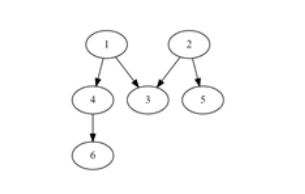

# 13.  그래프 경로

**※ SW Expert 아카데미의 문제를 무단 복제하는 것을 금지합니다.**  
  
  
V개 이내의 노드를 E개의 간선으로 연결한 방향성 그래프에 대한 정보가 주어질 때, 특정한 두 개의 노드에 경로가 존재하는지 확인하는 프로그램을 만드시오.  
  
두 개의 노드에 대해 경로가 있으면 1, 없으면 0을 출력한다.  
 

예를 들어 다음과 같은 그래프에서 1에서 6으로 가는 경로를 찾는 경우, 경로가 존재하므로 1을 출력한다.



노드번호는 1번부터 존재하며, V개의 노드 중에는 간선으로 연결되지 않은 경우도 있을 수 있다.

**\[입력\]**  
 

```python
첫 줄에 테스트 케이스 개수 T가 주어진다. 1≤T≤50
다음 줄부터 테스트 케이스의 첫 줄에 V와 E가 주어진다. 5≤V≤50, 4≤E≤1000 

테스트 케이스의 둘째 줄부터 E개의 줄에 걸쳐, 출발 도착 노드로 간선 정보가 주어진다. 

E개의 줄 이후에는 경로의 존재를 확인할 출발 노드 S와 도착노드 G가 주어진다.
-----------------------------------------------------------------
3
6 5
1 4
1 3
2 3
2 5
4 6
1 6
7 4
1 6
2 3
2 6
3 5
2 5
9 9
2 6
4 7
5 7
1 5
2 9
3 9
4 8
5 3
7 8
1 9
-----------------------------------------------------------------
```


**\[출력\]**

```python
각 줄마다 "#T" (T는 테스트 케이스 번호)를 출력한 뒤, 답을 출력한다.
---------------------------------------------------------------
#1 1
#2 1
#3 1
---------------------------------------------------------------
```



```python
def DFS(src, dst, adjList):	
    visited = [src]	                                       # first visited node : 1
    stack = adjList[src]	                                 # adjacent Nodes with 1 : 3, 4
    
    while len(stack) != 0:		
        visit = stack.pop()        		                     # first: 4, second: 3
        for num in adjList[visit]:                         # adjacent Node with 4			
            stack.append(num)		                           # append that to stack
            if visit not in visited: visited.append(visit)		
            else: pass
            	
    if dst in visited: return 1	
    else: return 0    

def makeAdj(numV, numE):	
    vertexList = [ i for i in range(1,numV+1)]	
    adjList = {vertex:[] for vertex in vertexList}	
    for _ in range(numE):		
        strt, fnsh = map(int, input().split())		
        adjList[strt].append(fnsh)	
    #adjList = [ [node1과 인접노드들], [node2과 인접노드들], ... ]
    return adjList

T = int(input())
for test_case in range(1, T+1):	
    numV, numE = map(int, input().split())	
    adjList = makeAdj(numV, numE)	
    src, dst = map(int, input().split())	
    answer = DFS(src, dst, adjList)	
    print("#{} {}".format(test_case, answer))
```



```python
def DFS(start):    
    global result    
    visited[start] = 1    
    for next in range(1, v+1):        
        if MyMap[start][next] and not visited[next]:            
            if next == end_node:                
                result = 1                
    return DFS(next)

TC = int(input())
for tc in range(1, TC+1):    
    v, e = map(int, input().split())    
    MyMap = [[0]*(v+1) for _ in range(v+1)]    
    visited = [0] * (v+1)    
    for i in range(e):        
        start, end = map(int, input().split())        
        MyMap[start][end] = 1    
    start_node, end_node = map(int, input().split())
    result = 0    
    DFS(start_node)    
    print(f'#{tc} {result}')
```



